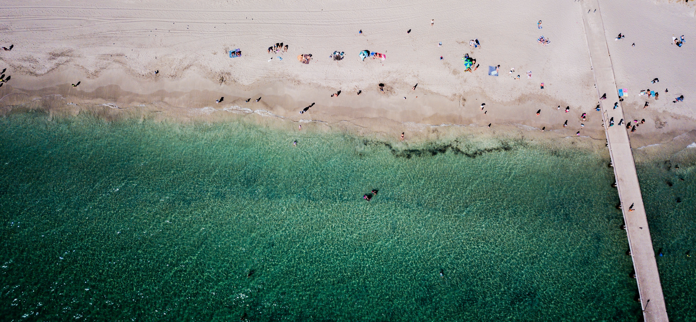

> 3D models have an increasing number of applications, from 3D printing, to creating custom LEGO instructions.  How can the average Joe get started without having to learn complex software?

## Capturing the images

Assuming there aren't already suitable pictures of the object you want to convert to a 3D, the first thing to consider is what means are available to you to capture the images.  Just about everyone has a decent camera in their pocket in the form of a smartphone--but there is a cool technology that some (usually higher end) smartphones and tablets have available called a [<u>Time-of-Flight camera</u>](https://en.wikipedia.org/wiki/Time-of-flight_camera).  These cameras can actually capture a 3D image--saving quite a bit of work!

### Using Time-of-Flight cameras

Devices that include ToF Cameras (not comprehensive!):
* iPhone Pro and Pro Max (iPhone 12 Pro and higher)
* iPad Pro (2020 and later)
* LG V60
* Samsung Galaxy A80, S20+ and Ultra
* Samsung Note10+

Many others can do a decent job of simulating similar depth modeling by using multiple back-facing cameras simultaneously, or by using onboard software to try to extrapolate a 3D model from a series of images taken quickly.  Check [<u>this list of Android devices</u>](https://developers.google.com/ar/devices), and look for those that 'Support Depth API' or mention supporting the feature using hardware.

 

If you aren't sure whether your smartphone supports this type of image capture, download one of the Android/iOS apps in the [<u>Selecting image processing software</u>](#selecting-image-processing-software) section of this guide and experiment.  At worst, there will be an extra app to uninstall--at best a lot of time could be saved!

### Using traditional cameras

Of course most folks (myself included) don't have a device with a ToF camera.  We have to make do with a normal camera.  In this case, it is actually going to be important to select the software you plan to use *before* deciding how to capture the images.  The software will dictate what is needed from the images: what angles, backgrounds, and quantity of pictures should be taken for the optimal result.  Also, software that runs either in a web site or on our PC is going to be best: for the kind of processing needed to analyze a bunch of flat, 2d images a smartphone usually doesn't have the horsepower (or a large enough screen to view the results)!

## Selecting image processing software

There are three types of software to consider: software built into a smartphone/tablet that takes the images and builds the model live (running on iOS or Android), or software that runs on a PC and analyzes images to build the models.  Lastly, a new breed of these apps that run 'in the cloud' (in a website as a 'web app') may be an option if no PC with enough horsepower is available to do the job.

 

### Android/iOS apps
> Note that many of these apps require specific cameras (ToF or ARCore support), and generally have poor reviews as a result from those whose cameras were not supported.  Experiment and find out what works!

| App | Platform(s) | Cost | Formats | Notes |
|-----|-------------|------|---------|-------|
| 3D Live Scanner | Android | $29.99 | | In early access as of 2022.03 |
| SCANN3D | Android | Cost per model | | |
| Sony 3d Creator | Sony Android only | | |
| 3D Scanner Pro | Android/iOS | $4.99 | | Pro version includes 'credits' for up to 40 models, 12 downloadable.  Free version is '3D Scanner Lite' |
| QLone | Android/iOS | $19.99 | OBJ, STL | uses special mat to increase quality but also limits size of object scanned |
| 3D Scanner - Model Builder | iOS | $3.99 | | iOS version of 3D Scanner Pro above |
| Trnio | iOS | $4.99 | OBJ |  Captures objects using camera |
| Scandy Pro | iOS w/Lidar | per-model cost | STL | Intended for use with Lidar (iPhone/iPad Pro) |
| 3D Scanner App | iOS w/Lidar | free | OBJ, STL, USDZ | |
| Polycam | iOS (Android under dev) | $7.99/mo | Most formats, incl OBJ, STL | works with or without lidar.  Aso has a web-based tool |

### Desktop apps

Meshroom

### Web-based apps
| App | Cost | Notes |
|-----|------|-------|
| [<u>Polycam</u>](https://poly.cam/) | $4.59 - $6.99/mo | |

